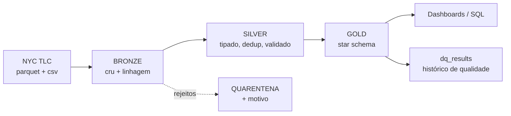

# NYC Taxi Lakehouse — pipeline ELT com arquitetura medalhão

Pipeline ELT em **PySpark + Delta Lake** sobre os dados públicos de corridas de
táxi de Nova York, com arquitetura medalhão (bronze/silver/gold) e modelagem
dimensional para consumo analítico. Roda no **Databricks** e, com o mesmo código,
localmente — o que torna a suíte de testes possível.

[](../../actions)



## O que este projeto demonstra

| Competência | Onde está no código |
|---|---|
| Arquitetura medalhão com contrato por camada | [`docs/architecture.md`](docs/architecture.md) |
| Transformações em PySpark testáveis (funções puras) | [`src/nyc_taxi/silver.py`](src/nyc_taxi/silver.py) |
| Modelagem dimensional (Kimball) — 1 fato, 6 dimensões | [`docs/data_model.md`](docs/data_model.md) |
| SCD Tipo 2 com `MERGE` do Delta | [`io.upsert_scd2`](src/nyc_taxi/io.py) |
| Cargas idempotentes com `replaceWhere` | [`io.overwrite_partitions`](src/nyc_taxi/io.py) |
| Qualidade de dados declarativa + quarentena | [`conf/pipeline.yml`](conf/pipeline.yml), [`quality.py`](src/nyc_taxi/quality.py) |
| Orquestração como código (Asset Bundle) | [`resources/job.yml`](resources/job.yml) |
| Testes automatizados e CI | [`tests/`](tests/), [`.github/workflows/ci.yml`](.github/workflows/ci.yml) |

Roadmap de evolução e critérios de pronto por fase: [`docs/roadmap.md`](docs/roadmap.md).

## Quickstart

```bash
git clone https://github.com/SEU-USUARIO/nyc-taxi-lakehouse.git
cd nyc-taxi-lakehouse

make install                                    # venv + dependências
python scripts/download_data.py --months 2024-01
make run                                        # bronze → silver → gold
make test                                       # 27 testes
```

Para rodar no Databricks Free Edition (conta gratuita, sem cartão), siga
[`docs/runbook.md`](docs/runbook.md).

## Estrutura

```
conf/pipeline.yml        configuração única — perfis, regras, expectativas
src/nyc_taxi/
  config.py              carregamento e resolução de nomes de tabela
  session.py             SparkSession: Databricks ou local, mesmo código
  io.py                  primitivas Delta: replaceWhere, SCD1, SCD2, OPTIMIZE
  bronze.py              ingestão crua + linhagem
  silver.py              conformação, dedup, validação, quarentena
  gold.py                star schema (fato + 6 dimensões)
  quality.py             motor de expectativas com histórico
  run.py                 CLI única, usada por notebooks e pelo job
notebooks/               wrappers finos para o Databricks
resources/job.yml        job com 3 tasks encadeadas (Asset Bundle)
scripts/                 download dos dados + queries analíticas
tests/                   PySpark + Delta local, sem mocks
docs/                    arquitetura, modelo de dados, runbook
```

## Camadas

**Bronze** — o parquet da TLC exatamente como veio, mais `_ingested_at`,
`_source_file` e `_batch_id`. Nenhum filtro, nenhuma correção. É o único ponto
insubstituível do pipeline: tudo depois dele é recalculável.

**Silver** — schema canônico e estável (a TLC troca a capitalização das colunas
entre anos e adiciona campos novos), tipos explícitos, deduplicação por chave
natural derivada e validação contra as regras do YAML.

Linhas inválidas **não são descartadas** — vão para
`silver.fct_source_trips_quarantine` com um array listando cada regra violada.
A conta sempre fecha: `bronze = silver + quarentena`. Um pipeline que joga dado
fora silenciosamente é um pipeline que ninguém consegue auditar.

**Gold** — star schema com grão de uma corrida. Toda dimensão tem membro
"Não informado" (`-1`), então a fato nunca tem FK nula nem órfã e o analista não
perde linhas em `INNER JOIN`.

## Exemplo de consulta sobre a gold

```sql
SELECT t.day_period,
       l.borough,
       count(*)                          AS corridas,
       round(avg(f.trip_distance_km), 2) AS km_medio,
       round(sum(f.total_amount), 2)     AS receita
FROM gold.fct_trips f
JOIN gold.dim_time t     ON f.pickup_time_key     = t.time_key
JOIN gold.dim_location l ON f.pickup_location_key = l.location_key
GROUP BY 1, 2
ORDER BY receita DESC;
```

Sem CTE aninhada, sem subquery correlacionada. Se responder uma pergunta de
negócio exigisse contorcionismo em SQL, o modelo dimensional estaria errado.
Mais exemplos em [`scripts/analytics_queries.sql`](scripts/analytics_queries.sql).

## Decisões que valem explicar

- **`trip_id` determinístico.** A TLC não publica identificador de corrida. O id é
  o SHA-256 da chave natural — a mesma corrida gera o mesmo id em qualquer
  execução, o que é o que permite deduplicar e fazer `MERGE` sem depender da ordem
  de chegada dos dados.
- **`dim_location` é SCD Tipo 2, e a fato usa a versão vigente na data da corrida.**
  Sem esse detalhe no join, SCD2 vira só três colunas extras sem utilidade.
- **`dim_date` é gerada, não derivada dos fatos.** Com `SELECT DISTINCT`, um dia sem
  corridas não existiria, e "receita por dia" passaria a mentir.
- **Regras e expectativas moram em YAML.** Adicionar uma verificação não exige PR
  de Python — importa quando quem conhece a regra é o analista.
- **Vendor, rate code e payment type usam o próprio código como chave.** Domínios
  de menos de 10 linhas, definidos em um PDF público, que não mudam. Escolha
  consciente, documentada em [`docs/data_model.md`](docs/data_model.md).

## Testes

```bash
make test
```

A suíte roda contra um Spark local com Delta de verdade — sem mocks. Cobre as
transformações silver, o modelo dimensional, o motor de expectativas e, o mais
importante, **idempotência** (reprocessar `2024-01` não pode afetar `2024-02`) e
**SCD Tipo 2** (mudar um atributo cria versão; não mudar nada, não).

## Dados

[NYC Taxi & Limousine Commission — Trip Record Data](https://www.nyc.gov/site/tlc/about/tlc-trip-record-data.page),
domínio público. Yellow taxi, ~3 milhões de corridas por mês.

## Licença

MIT
