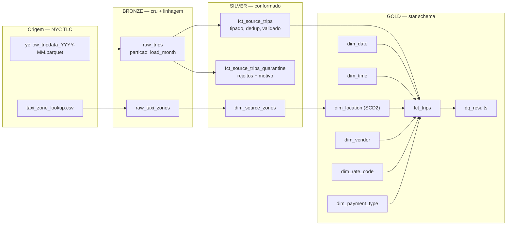

# Arquitetura

## Visão geral

## Por que ELT e não ETL

Os dados são carregados **antes** de serem transformados. O parquet cru vai
inteiro para bronze e só então o Spark transforma. A vantagem prática: quando uma
regra de negócio muda — e ela sempre muda — dá para reprocessar silver e gold a
partir do bronze, sem voltar à origem. Em ETL clássico, a transformação acontece
antes da carga e o dado original se perde.

## Contrato de cada camada

| | Bronze | Silver | Gold |
|---|---|---|---|
| **Responsabilidade** | Fidelidade à origem | Correção e confiabilidade | Usabilidade analítica |
| **Schema** | O que a origem mandou | Canônico, tipado, estável | Star schema |
| **Regra de negócio** | Nenhuma | Todas | Nenhuma nova |
| **Duplicatas** | Permitidas | Removidas | Impossíveis (grão garantido) |
| **Quem consome** | Engenheiro de dados | Engenheiro / cientista de dados | Analista, BI, dashboard |
| **Pode ser recriada?** | Não (é o backup da origem) | Sim, a partir de bronze | Sim, a partir de silver |

A linha mais importante é a última. Bronze é o único ponto insubstituível do
pipeline; tudo depois dele é derivável.

## Decisões técnicas

### Idempotência via `replaceWhere`

Toda escrita particionada usa `replaceWhere` no mês alvo. Reprocessar `2024-01`
substitui apenas as partições daquele mês — `2024-02` fica intacto. Sem isso,
qualquer retry de job vira duplicação de dados ou apagamento acidental do
histórico.

Testado em `tests/test_quality_and_io.py::test_replace_where_reprocessa_so_o_mes_alvo`.

### Quarentena em vez de descarte

`WHERE trip_distance > 0` num pipeline é uma decisão silenciosa: alguém vai
perguntar por que o total de janeiro não bate com o relatório da TLC e não haverá
resposta. Aqui as linhas rejeitadas vão para
`silver.fct_source_trips_quarantine` com um array `_violations` listando cada
regra violada. A conta sempre fecha: `bronze = silver + quarentena`.

### Chave natural derivada (`trip_id`)

A TLC não publica um identificador de corrida. O `trip_id` é o SHA-256 de
(vendor, pickup, dropoff, origem, destino, distância, total). É **determinístico**:
a mesma corrida gera o mesmo id em qualquer execução, em qualquer máquina. Isso é
o que permite deduplicar e fazer `MERGE` sem depender da ordem de chegada.

### Regras e expectativas em YAML, não em Python

`conf/pipeline.yml` guarda as regras de validação e as expectativas de qualidade.
Adicionar uma verificação não exige mexer no código de transformação — o que
importa quando quem conhece a regra de negócio é o analista, não o engenheiro.

### Qualidade com histórico

Cada execução grava o resultado das expectativas em `gold.dq_results`. Um
pipeline que só falha não responde "quando isso começou a piorar?". Com o
histórico, responde.

### Compute serverless

O Databricks Free Edition oferece **apenas** serverless — não há cluster
customizável. O código evita qualquer configuração de cluster e não usa nada que
o serverless não suporte (sem RDD API, sem `sc.parallelize`, sem UDF em Scala).
Isso mantém o projeto reproduzível por quem clonar o repositório sem pagar nada.

### O mesmo código roda local e no Databricks

`session.py` detecta `DATABRICKS_RUNTIME_VERSION`. Fora do Databricks, sobe um
Spark local com Delta e um metastore em arquivo; o resto do código é idêntico.
Sem essa simetria, os testes não existiriam — e sem testes, o projeto seria um
notebook grande com uma boa fachada.

## Limites conhecidos

- **Batch, não streaming.** Auto Loader e Structured Streaming ficam de fora nesta
  fase. O caminho de evolução está em `docs/runbook.md`.
- **Sem `MERGE` incremental na fato.** A carga da gold reescreve as partições do
  mês. Para volumes maiores que alguns bilhões de linhas, o passo seguinte é
  CDF (Change Data Feed) no silver + `MERGE` na fato.
- **Free Edition tem quota diária.** Estourar a quota derruba o compute pelo resto
  do dia. Por isso o `conf/pipeline.yml` traz 3 meses por padrão, não 3 anos.
