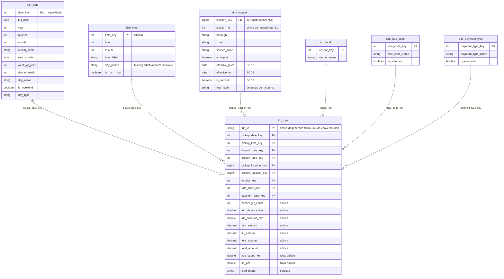

# Modelo dimensional — camada gold

## Grão

**Uma linha de `fct_trips` = uma corrida de táxi.**

Definir o grão antes de escolher dimensões ou métricas é o passo que evita 90% dos
problemas de modelagem. Tudo o que segue deriva dessa frase.

## Diagrama



## Decisões de modelagem

### Membro "Não informado" (`-1`) em toda dimensão

A TLC publica códigos que não existem no dicionário oficial — `payment_type = 77`,
`RatecodeID = 88`, zonas fora do range 1–265. Três saídas possíveis:

| Opção | Consequência |
|---|---|
| Descartar a linha | Perde receita real do fato. Inaceitável. |
| Deixar a FK nula | `INNER JOIN` some com a linha silenciosamente. Pior ainda. |
| Apontar para `-1` | A corrida aparece em todo relatório, rotulada como "Não informado". |

O pipeline usa a terceira. É por isso que a expectativa `no_orphan_location_keys`
consegue ser `severity: fail` — não há caso legítimo de órfã.

### `dim_date` e `dim_time` são geradas, não derivadas dos fatos

Se a dimensão de calendário for construída com `SELECT DISTINCT pickup_date`, um
dia sem corridas simplesmente não existe — e aí "receita por dia" mente, porque o
zero vira ausência de linha em vez de zero. `dim_date` é uma sequência contínua.

`dim_time` tem grão de minuto (1440 linhas) e é *estática*: nunca precisa de recarga.

### `dim_location` é SCD Tipo 2

A TLC renomeia zonas ocasionalmente. Com SCD Tipo 1, renomear "Lincoln Square East"
reescreveria o passado inteiro e um relatório de 2023 mudaria retroativamente.

Com SCD Tipo 2, a versão antiga é fechada (`effective_to`, `is_current = false`) e
uma nova é aberta. **A fato faz join pela versão vigente na data da corrida**, não
pela versão atual:

```python
t.pickup_date BETWEEN pu.effective_from AND pu.effective_to
```

Sem esse detalhe, o SCD2 vira só colunas extras sem utilidade.

### Dimensões de código estático usam o próprio código como chave

`vendor_key`, `rate_code_key` e `payment_type_key` são os códigos da TLC, não
surrogates. São domínios de menos de 10 linhas, definidos em um PDF público, que
não mudam. Criar uma surrogate exigiria um lookup a cada carga para ganhar
exatamente nada. É uma escolha consciente, não um descuido — e está documentada
justamente para deixar isso claro em uma code review.

### Métricas aditivas vs. não aditivas

`avg_speed_kmh` e `tip_pct` estão marcadas como **não aditivas** no diagrama:
`SUM(tip_pct)` não significa nada. Quem consome precisa recalcular a partir das
parcelas (`sum(tip_amount) / sum(fare_amount)`). Guardá-las na fato é conveniência
para análise linha a linha, não para agregação.

## Particionamento

| Tabela | Partição | Motivo |
|---|---|---|
| `bronze.raw_trips` | `load_month` | Reprocessar um mês sem tocar nos outros |
| `silver.fct_source_trips` | `load_month` | Idem, e a maioria das consultas filtra período |
| `gold.fct_trips` | `load_month` | Idem + Z-ORDER em `pickup_location_key` |
| Dimensões | nenhuma | Pequenas demais; particionar só criaria small files |

Com Delta, `load_month` + `replaceWhere` é o que torna a carga idempotente: rodar
`2024-01` cinco vezes produz exatamente o mesmo resultado que rodar uma vez.
